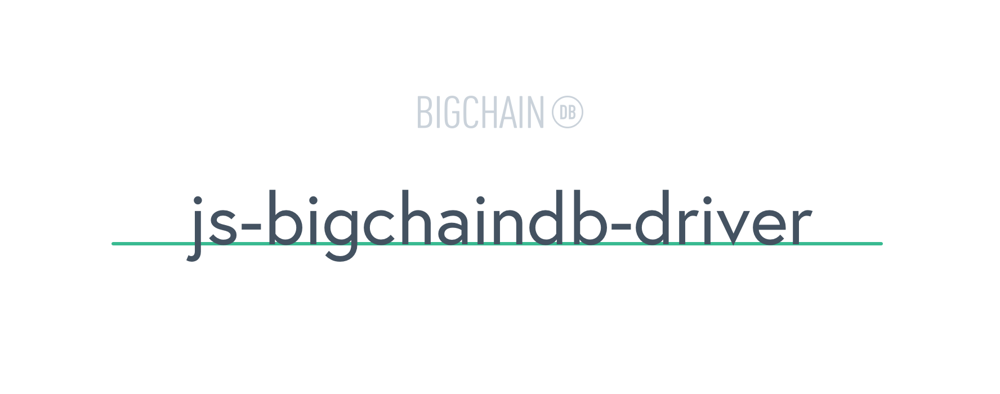

# [](https://www.bigchaindb.com)

> Official Node.js driver for [BigchainDB](https://github.com/bigchaindb/bigchaindb) with some naive helpers to get you on your way making transactions with BigchainDB and Node.js.

[](https://www.npmjs.com/package/js-bigchaindb-driver)
[](https://github.com/ascribe/javascript)
[](https://travis-ci.org/bigchaindb/js-bigchaindb-driver)
[](https://greenkeeper.io/)

## Compatibility

| BigchainDB Server | BigchainDB Node.js Driver |
| ----------------- |------------------------------|
| `~=0.10.1` | `~=0.1.0` |


## Contents

- [Installation](#installation)
- [Usage](#usage)
- [Speed Optimizations](#speed-optimizations)
- [Warnings](#warnings)
- [npm releases](#npm-releases)
- [Authors](#authors)
- [License](#license)
- [API reference](API.md)

## Installation

```bash
# install from npm
npm install bigchaindb-driver
```

## Usage

You'll probably need a babel here and a bundler there. Alternatively, use [one of the bundled dist versions](./dist).

```js
import * as driver from 'js-bigchaindb-driver';

// http(s)://<bigchaindb-API-url>/ (e.g. http://localhost:9984/api/v1/)
const API_PATH = 'http://localhost:9984/api/v1/';

// create a new user with a public-private keypair
const alice = new driver.Ed25519Keypair();

// Create a transation
const tx = driver.Transaction.makeCreateTransaction(
    { assetMessage: 'My very own asset...' },
    { metaDataMessage: 'wrapped in a transaction' },
    [ driver.Transaction.makeOutput(
            driver.Transaction.makeEd25519Condition(alice.publicKey))
    ],
    alice.publicKey
);

// sign/fulfill the transaction
const txSigned = driver.Transaction.signTransaction(tx, alice.privateKey);

// send it off to BigchainDB
let conn = new driver.Connection(PATH, { 'Content-Type': 'application/json' });
conn.postTransaction(txSigned)
    .then(() => conn.getStatus(txSigned.id))
    .then((res) => console.log('Transaction status:', res.status));
```

You may also be interested in some [long-form tutorials with actual code](https://github.com/bigchaindb/kyber).

The expected flow for making transactions:

1. Go get yourself some keypairs. (or a whole bunch of them, nobody's counting)
    - `new driver.Ed25519Keypair()` 
2. Construct a transaction payload that you can send off to BigchainDB:
    - `driver.Transaction.makeCreateTransaction()` for creating a new asset or
    - `driver.Transaction.makeTransferTransaction()` for transfering an existing asset
3. A transaction needs an output (\*):
    - `driver.Transaction.makeOutput()` still requires a crypto-condition
    - `driver.Transaction.makeEd25519Condition()` should do the trick for a simple public key output.
4. (**Optional**) You've got everything you need, except for an asset and metadata. Maybe define them (any JSON-serializable object will do).
5. Ok, now you've got a transaction, but we need you to *sign* it cause, you know... cryptography and `¯\_(ツ)_/¯`:
   - `driver.Transaction.signTransaction()` allows you to sign with private keys.
6. Final step is to send the transaction off to BigchainDB:
   - `driver.Connection.postTransaction()`

(\*) If you're not sure what any of this means (and you're as confused as I think you are right now), you might wanna go check out [this](https://docs.bigchaindb.com/projects/server/en/latest/data-models/crypto-conditions.html) and [this](https://docs.bigchaindb.com/projects/py-driver/en/latest/usage.html#asset-transfer) and [this](https://tools.ietf.org/html/draft-thomas-crypto-conditions-01) first.

## Speed Optimizations

This implementation plays "safe" by using JS-native (or downgradable) libraries for its crypto-related functions to keep compatibilities with the browser. If you do want some more speed, feel free to explore the following: 

* [chloride](https://github.com/dominictarr/chloride), or its underlying [sodium](https://github.com/paixaop/node-sodium)
  library
* [node-sha3](https://github.com/phusion/node-sha3) -- **MAKE SURE** to use [steakknife's fork](https://github.com/steakknife/node-sha3)
  if [the FIPS 202 upgrade](https://github.com/phusion/node-sha3/pull/25) hasn't been merged
  (otherwise, you'll run into all kinds of hashing problems)

## Warnings

> Crypto-conditions

Make sure you keep using a crypto-conditions implementation that implements the older v1 draft (e.g.
[`five-bells-condition@v3.3.1`](https://github.com/interledgerjs/five-bells-condition/releases/tag/v3.3.1)).
BigchainDB Server 0.10 does not implement the newer version of the spec and **WILL** fail if you try using a newer implementation of crypto-conditions.

> SHA3

Make sure to use a SHA3 implementation that has been upgraded as per [FIPS 202](http://csrc.nist.gov/publications/drafts/fips-202/fips_202_draft.pdf).
Otherwise, the hashes you generate **WILL** be invalid in the eyes of the BigchainDB Server.

> Ed25519

If you do end up replacing `tweetnacl` with `chloride` (or any other `Ed25519` package), you might
want to double check that it gives you a correct public/private (or verifying/signing, if they use
that lingo) keypair.

An example BigchainDB Server-generated keypair (encoded in `base58`):

- Public: `DjPMHDD9JtgypDKY38mPz9f6owjAMAKhLuN1JfRAat8C`
- Private: `7Gf5YRch2hYTyeLxqNLgTY63D9K5QH2UQ7LYFeBGuKvo`

Your package should be able to take in the decoded version of the **private** key and return you the
same **public** key (once you encode that to `base58`).

## npm releases

For a new **patch release**, execute on the machine where you're logged into your npm account:

```bash
npm run release
```

Command is powered by [`release-it`](https://github.com/webpro/release-it) package, defined in the `package.json`.

That's what the command does without any user interaction:

- create release commit by updating version in `package.json`
- create tag for that release commit
- push commit & tag
- create a new release on GitHub, with change log auto-generated from commit messages
- publish to npm as a new release

If you want to create a **minor** or **major release**, use these commands:

```bash
npm run release-minor
```

```bash
npm run release-major
```

## Authors

* inspired by [`js-bigchaindb-quickstart`](https://github.com/sohkai/js-bigchaindb-quickstart) of @sohkhai [thanks]
* BigchainDB <dev@bigchaindb.com>

## License

```
Copyright 2017 BigchainDB GmbH

Licensed under the Apache License, Version 2.0 (the "License");
you may not use this file except in compliance with the License.
You may obtain a copy of the License at

   http://www.apache.org/licenses/LICENSE-2.0

Unless required by applicable law or agreed to in writing, software
distributed under the License is distributed on an "AS IS" BASIS,
WITHOUT WARRANTIES OR CONDITIONS OF ANY KIND, either express or implied.
See the License for the specific language governing permissions and
limitations under the License.
```
